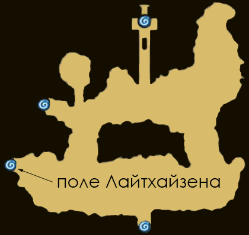
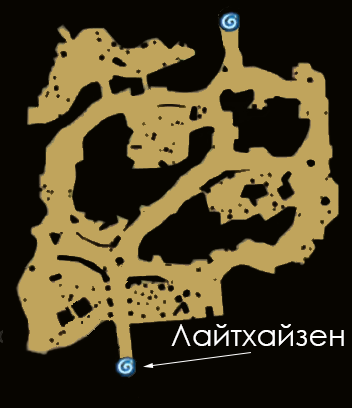
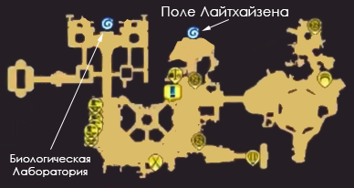

<h1 id="карты-местности-мобы-и-лут">Карты местности, мобы и лут</h1>

Эпизод 6.0 порадует игроков новыми локациями – город Лайтхайзен, его окрестности и Биологическая Лаборатория (Институт жизни).

На данных локациях обитают качественно новые мобы, из которых падает новый лут и, разумеется, карты.

Далее будет представлен карткий гайд по тому, как добраться до всех локаций, каких мобов там можно найти, какой лут из них выпадает и, конечно, какие бонусы дают новые карты.

Чтобы добраться до окрестностей Лайтхайзена нужно пройти в левый нижний варп поля Эйнброча.

<h2 id="поле-лайтхаёзена">Поле Лайтхаёзена</h2>

На этой карте вы столкнётесь с Металлингами, Бризом и Мусорщиком Мартином.

<table>
<thead>
<tr>
<th>Название</th>
<th>Опыт</th>
<th>Информация</th>
<th>Новый лут</th>
<th>Карта</th>
</tr>
</thead>
<tbody>
<tr>
<td>Металлинг (Ур 125)</td>
<td>База: 2,379 Джоб: 1,527</td>
<td>Бесформенный, Нейтрал, Маленький</td>
<td>Metal Mask Blueprint</td>
<td><strong>Оружие</strong> <strong>Эффект:</strong>  АТК +20. При нанесении физического урона есть 5% шанс использовать Lv 1 [Strip  Accessory]. [Эффект карт не складывается.] <strong>Депозит:</strong>  МАТК+3, Макс ХП +36 <strong>Получение:</strong>  Макс ХП +60</td>
</tr>
<tr>
<td>Бриз (Ур 127)</td>
<td>База: 2,657 Джоб: 1,412</td>
<td>Бесформенный, Ветер, Средний</td>
<td>Leaf On Head [1] Blueprint, Chemical Gas Cylinder</td>
<td><strong>Оружие</strong> <strong>Эффект:</strong>  АТК +20. При атаке есть 5% шанс нанести [Bleed] на 3 секунды. [Эффект карт не складывается.] <strong>Депозит</strong>**:**  Макс ХП +72<strong>Получение****:</strong>  МАТК +8</td>
</tr>
<tr>
<td>Мусорщик Мартин (Ур 129)</td>
<td>База: 2,657 Джоб: 1,458</td>
<td>Брут Земля Маленький</td>
<td>Chemical Gas Cylinder, Laser Glasses Blueprint</td>
<td><strong>Оружие</strong> <strong>Эффект:</strong>  АТК +20. При нанесении физического урона есть 5% шанс использовать Lv 1 [Strip  Accessory]. [Эффект карт не складывается.] <strong>Вторая рука</strong> <strong>Эффект:</strong>  Урон [Storm  Gust] увеличен на 5%  <strong>Депозит:</strong>  Макс ХП +36 <strong>Получение:</strong>  АТК +3</td>
</tr>
</tbody>
</table>
Чтобы попасть в сам Лайтхайзен игрок должен пройти в южный варп.

<h2 id="лайтхайзен">Лайтхайзен</h2>

Данный город – дом для таинственной Корпорации Rekenber, которая с помощью достижений в науке и технике смогла создавать механические прототипы живых организмов, однако их эксперименты не прошли без следа…

Левый верхний портал города ведёт в офисные помещения Биологической Лаборатории.

<h2 id="офисные-помещения-биологической-лаборатории">Офисные помещения Биологической Лаборатории</h2>

На данной локации нет мобов. Для того, чтобы пройти вглубь лаборатории, необходимо воспользоваться верхним варпом.

<h2 id="первый-этаж-биологической-лаборатории">Первый этаж Биологической лаборатории</h2>

На первом этаже Биологической Лаборатории обитают Мутировавшие Слизни, Уничтожители, три типа обычнх доппельгангеров (мобов, которые похожи на игроков) Лаборатории – Тёмный Мечник, Тёмный Торговец, Тёмный Вор, один мини-босс Armaia Dinze и один МВП Eremes Guile.

<table>
<thead>
<tr>
<th>Название</th>
<th>Опыт</th>
<th>Информация</th>
<th>Новый лут</th>
<th>Карта</th>
</tr>
</thead>
<tbody>
<tr>
<td>Тёмный Мечник (Ур 131)</td>
<td>База :2,623 Джоб: 1,524</td>
<td>Получеловек, Огонь, Средний</td>
<td>Swordsman Mask Blueprint</td>
<td><strong>Броня</strong> <strong>Эффект:</strong>  Игрок получает 1 INT  за каждые 10 единиц STR <strong>Депозит:</strong>  Макс ХП +36 <strong>Получение:</strong>  МДеф +3</td>
</tr>
<tr>
<td>Тёмный Торговец (Ур 132)</td>
<td>База: 2,768 Джоб: 1,463</td>
<td>Получеловек, Земля, Средний</td>
<td>Merchant’s Hat [1] Blueprint</td>
<td><strong>Аксессуар</strong> <strong>Эффект:</strong>  Увеличение шанса поломки экипировки от [Acid  Terror], [Demonstration] и [Acid  Demonstration] на 5% [Эффект карт не складывается.] <strong>Депозит:</strong> DEF +2, Max HP +36  <strong>Получение:</strong> ATK +3, Max HP +36</td>
</tr>
<tr>
<td>Тёмный Вор (Ур 132)</td>
<td>База: 2,504 Джоб: 1,617</td>
<td>Получеловек, Яд, Средний</td>
<td>New Poison, Semiconductor, Thief Mask Blueprint</td>
<td><strong>Накидка</strong> <strong>Эффект:</strong>  Снижение получаемого урона от огня на 5%. Урон от [Cross  Impact] увеличен на 15% <strong>Депозит:</strong>  МДеф +2, Макс ХП+36 <strong>Получение:</strong>  АТК+3, Макс ХП +36</td>
</tr>
<tr>
<td>Мутировавший слизень (Ур 130)</td>
<td>База: 2,603 Джоб: 1,513</td>
<td>Демон, Тень, Маленький</td>
<td>Semiconductor, Syringe Back Headwear Blueprint</td>
<td><strong>Ботинки</strong>, <strong>Эффект:</strong>  Макс ХП +100, Макс СП +100 <strong>Депозит:</strong>  Макс ХП +36 <strong>Получение:</strong>  Деф +3</td>
</tr>
<tr>
<td>Уничтожитель (Ур 126)</td>
<td>База: 2,643 Джоб: 1,397</td>
<td>Нежить, Нежить, Средний</td>
<td>Moldy Gold Coins, Fireman’s Cap [1] Blueprint</td>
<td><strong>Броня</strong> <strong>Эффект:</strong>  Макс ХП +200, DEX +2, VIT +2  <strong>Депозит:</strong>  Макс ХП +36  <strong>Получение:</strong>  МАТК +3</td>
</tr>
<tr>
<td>Armaia Dinze (Ур 136)</td>
<td>База: 8,160  Джоб: 4,744</td>
<td>Получеловек, Земля, Средний</td>
<td>Chaotic Metal, Semiconductor, Hairpin Headwear [1] Blueprint, Chieftain’s Axe [1], General’s Manteau</td>
<td><strong>Накидка</strong> <strong>Эффект:</strong>  Снижение получаемого урона от нейтрального элемента на 10%. Урон от [Mammonite] увеличен на 15%  <strong>Депозит:</strong>  МДеф +3, Макс ХП +36  <strong>Получение:</strong>  АТК +8</td>
</tr>
<tr>
<td>Eremes Guile (Ур 138)</td>
<td>База: 44,309  Джоб: 22,378</td>
<td>Получеловек, Яд, Средний</td>
<td>Chaotic Metal, Corrupted Pendant, Trial Night Vision Instrument Blueprint, Fire Ninja Shinobi’s Belt, Spirit Cleansing Dagger[1]</td>
<td><strong>Броня</strong> <strong>Эффект:</strong>  Макс ХП +10%. При получении физического урона есть 100% шанс применить [Venom  Attack] 1 Уроня. <strong>Депозит:</strong>  Макс ХП +112  <strong>Получение:</strong>  Деф +1%, МДеф +1%</td>
</tr>
</tbody>
</table>
Для прохода на следующий этаж воспользуйтесь верхним варпом.

<h2 id="второй-этаж-биологической-лаборатории-западное-крыло">Второй этаж Биологической Лаборатории (западное крыло)</h2>

С первого этажа вы попадаете в западное крыло второго этажа.

На этом этаже обитают обычные мобы Механическая Гончая, Тёмный Лучник, Тёмный Маг и Тёмный Посушник и один МВП Kathryne Keyron.

<table>
<thead>
<tr>
<th>Название</th>
<th>Опыт</th>
<th>Информация</th>
<th>Новый лут</th>
<th>Карта</th>
</tr>
</thead>
<tbody>
<tr>
<td>Тёмный Лучник (Ур 131)</td>
<td>База: 2,623 Джоб: 1,524</td>
<td>Получеловек, Ветер, Средний</td>
<td>Semiconductor, Archer’s Hat [1] Blueprint</td>
<td><strong>Накидка</strong> <strong>Эффект:</strong>  Снижение урона от огня на 10%. Урон от [Arrow  Shower] [Severe  Rainstorm] увеличен на +10%  <strong>Депозит:</strong>  Макс ХП +72  <strong>Получение:</strong>  АТК +8</td>
</tr>
<tr>
<td>Тёмный Маг (Ур 131)</td>
<td>База: 2,389 Джоб: 1,661</td>
<td>Получеловек, Призрак, Средний</td>
<td>Chemical Gas Cylinder, Mage’s Garland [1] Blueprint</td>
<td><strong>Оружие</strong> <strong>Эффект:</strong>  МАТК +20. Шанс применить [Auto  Bolt] увеличен на 3%. [Эффект карт не складывается.]  <strong>Депозит:</strong> АТК+3, Макс ХП+36  <strong>Получение:</strong> Макс ХП +60</td>
</tr>
<tr>
<td>Тёмный Послушник (Ур 132)</td>
<td>База: 2,595 Джоб: 1,564</td>
<td>Получеловек, Святой. Средний</td>
<td>Chemical Gas Cylinder,  Acolyte Silver Ring [1] Blueprint</td>
<td><strong>Накидка</strong> <strong>Эффект:</strong>  При получении дистанционного урона есть 5% шанс применить [Kyrie  Eleison] 1 Уровня.  <strong>Депозит:</strong>  Макс ХП +36  <strong>Получение:</strong>  Деф +3</td>
</tr>
<tr>
<td>Механическая Гончая (Ур 128)</td>
<td>База: 2,501 Джоб: 1,526</td>
<td>Бурт, Нейтрал, Большой</td>
<td>Mechanical Tail Blueprint</td>
<td><strong>Оружие</strong> <strong>Эффект:</strong>  Урон от [Arms  Cannon] увеличен на 5%. Если заточка оружия +10 и выше, то урон от [Arms  Cannon] увеличен ещё на 5% [Эффект карт не складывается.]  <strong>Депозит:</strong>  МАТК +3, Макс ХП +36  <strong>Получение:</strong> Макс ХП +60</td>
</tr>
<tr>
<td>Kathryne Keyron (Ур 136)</td>
<td>База: 43,871 Джоб: 21,935</td>
<td>Получеловек, Призрак, Средний</td>
<td>Chemical Gas Cylinder, Wicked Heart, Lace Butterfly Hairband [1] Blueprint, Pocket Watch, Critical Ring</td>
<td><strong>Голова</strong> <strong>Эффект:</strong>  М. Проникновение +8%, Переменный КТ +5%, Восстановление СП +10%  <strong>Депозит:</strong>  Игнор МДеф +2% <strong>Получение:</strong>  АТК+12</td>
</tr>
</tbody>
</table><h2 id="второй-этаж-биологической-лаборатории-восточное-крыло">Второй этаж Биологической Лаборатории (восточное крыло)</h2>

Восточной крыло второго этажа дублирует западное, однако на нём мобы агрессивны по отношению к игроку. Однако вместо Kathryne Keyron на этом этаже обитает Cecil Damon

<table>
<thead>
<tr>
<th>Название</th>
<th>Опыт</th>
<th>Информация</th>
<th>Новый лут</th>
<th>Карта</th>
</tr>
</thead>
<tbody>
<tr>
<td>Cecil Damon (Ур 137)</td>
<td>База: 48,696 Джоб: 19,479</td>
<td>Получеловек, Ветер, Средний</td>
<td>Semiconductor, Warrior’s Will, Corrupted Pendant, Wind Follower [1] Blueprint, Sniper’s Manteau, Dragon Wing [1]</td>
<td><strong>Оружие</strong> <strong>Эффект:</strong>  Крит +5, Восстановление ХП -100%. При нанесении дистанционного урона есть 30% шанс восстановить жизнь в размере 20% от нанесённого урона [Эффект карт не складывается.] <strong>Депозит:</strong>  Крит +1, Критический урон +1% <strong>Получение:</strong> МАТК +12</td>
</tr>
</tbody>
</table><h2 id="третий-этаж-биологической-лаборатории">Третий этаж Биологической Лаборатории</h2>

Наконец, на последнем этаже единственный новый моб, с которым вы столкнётесь, будем мини босс Egnigem Cenia.

<table>
<thead>
<tr>
<th>Название</th>
<th>Опыт</th>
<th>Информация</th>
<th>Новый лут</th>
<th>Карта</th>
</tr>
</thead>
<tbody>
<tr>
<td>Egnigem Cenia (Ур 135)</td>
<td>База: 17,820 Джоб: 10,360</td>
<td>Получеловек, Огонь, Средний</td>
<td>Warrior’s Will, Broken Sword Back Headwear Blueprint, Mysteltainn [1], Giant Shield</td>
<td><strong>Вторая рука</strong> <strong>Эффект:</strong>  Макс ХП +5%. Снижение физического урона +5%  <strong>Депозит:</strong>  Деф +3, Макс ХП +36  <strong>Получение:</strong>  МАТК+8</td>
</tr>
</tbody>
</table>
